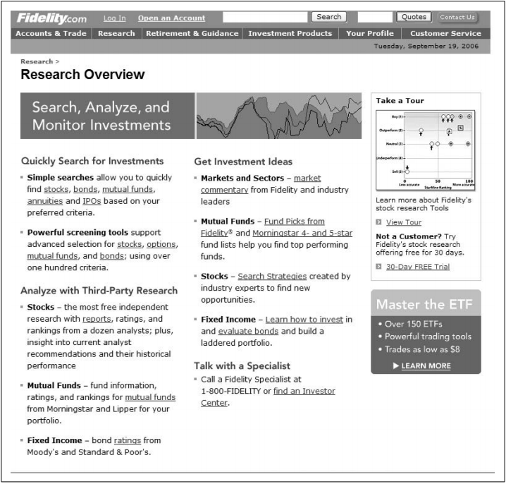
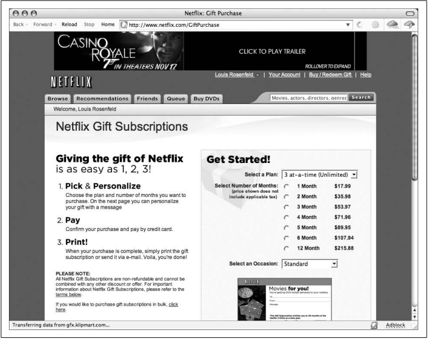
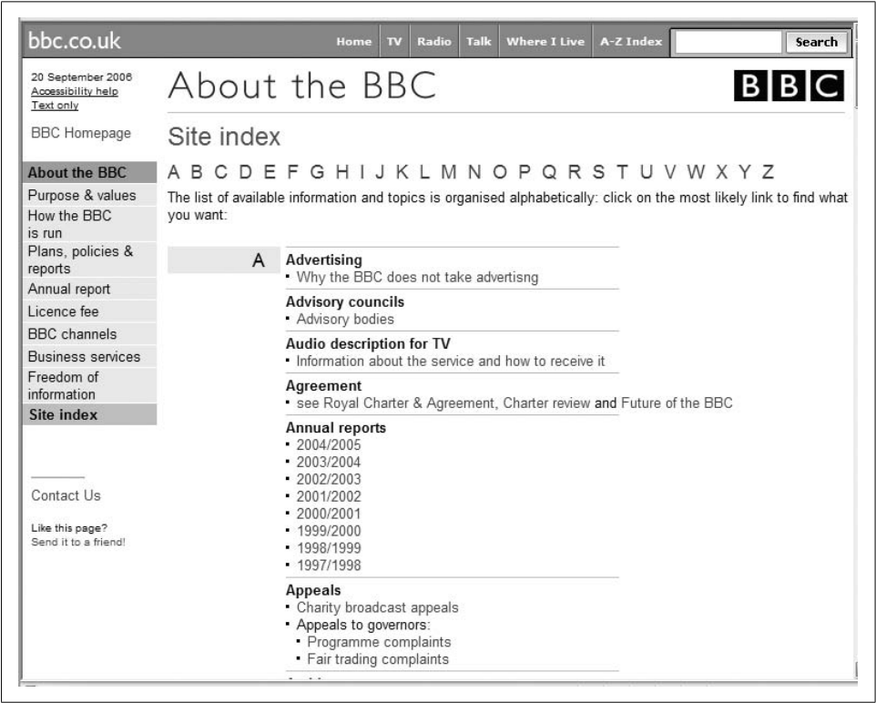
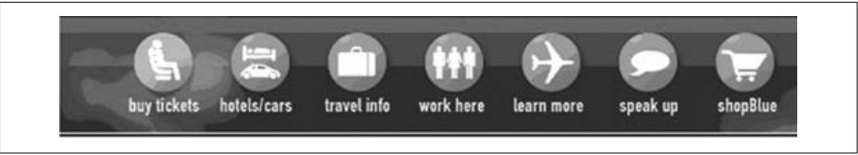

# Diseño de la Información 

## Introducción 

El etiquetado es una forma de representación. Al igual que usamos palabras habladas para representar conceptos y pensamientos, usamos etiquetas para representar grandes porciones de información en nuestros sitios web. Por ejemplo, "Contáctenos" es una etiqueta que representa una parte del contenido, que a menudo incluye un nombre de contacto, una dirección e información de teléfono, fax y correo electrónico. No puede presentar toda esta información de forma rápida y eficaz en una página web ya llena de usuarios sin abrumar a los usuarios impacientes que realmente no necesitan esa información. En cambio, una etiqueta cómo "Contáctenos" funciona como un atajo que activa la asociación correcta en la mente del usuario sin presentar todo eso de manera prominente.

## ¿Por qué debemos preocuparnos por el sistema de etiquetado? 

Desafortunadamente, cuando "conversamos" con los usuarios a través de los sitios web que diseñamos, los comentarios no son tan inmediatos, si es que existen. Ciertamente hay excepciones, por ejemplo, los blogs, pero en la mayoría de los casos, un sitio sirve como intermediario que traduce lentamente los mensajes de los propietarios y autores del sitio a los usuarios, y viceversa. Este "juego telefónico" confunde el mensaje. Por lo tanto, en un medio desintermediado con pocas señales visuales, la comunicación es más difícil y, por lo tanto, el etiquetado es más importante.

Para minimizar esta desconexión, los arquitectos de información deben esforzarse al máximo para diseñar etiquetas que hablen el mismo idioma que los usuarios de un sitio al tiempo que reflejan su contenido. Y, al igual que en un diálogo, cuando hay una pregunta o confusión sobre una etiqueta, debe haber aclaración y explicación. Las etiquetas deben educar a los usuarios sobre nuevos conceptos y ayudarles a identificar rápidamente los que les son familiares. 

La conversación entre el usuario y el propietario del sitio generalmente comienza en la página principal de un sitio. Para tener una idea de lo exitosa que puede ser esta conversación, consulte la página principal de un sitio, haga su mejor esfuerzo para ignorar los otros aspectos de su diseño y hágase algunas preguntas: ¿Se destacan las etiquetas destacadas de esta página? Si lo hacen, ¿por qué? (A menudo, las etiquetas exitosas son invisibles; no se interponen en su camino). Si una etiqueta es nueva, no está anticipada o es confusa, ¿hay alguna explicación? ¿O es necesario que hagas clic para obtener más información? Aunque no es científico, este ejercicio de prueba de etiquetas le ayudará a tener una idea de cómo podría ir la conversación con los usuarios reales.

Al igual que la escritura o cualquier otra forma de comunicación profesional, las etiquetas son importantes. Es justo decir que son tan integrales para una presencia web efectiva como cualquier otro aspecto de su sitio web, ya sea marca, diseño visual, funcionalidad, contenido o navegabilidad.

## Variedades de Etiquetas

En la Web, nos encontramos regularmente con etiquetas en dos formatos: textual e icónico. Trataremos de las etiquetas de texto ya que siguen siendo las más comunes a pesar de la naturaleza altamente visual de la Web. Incluyen:

#### Enlaces contextuales

Hipervínculos a fragmentos de información en otras páginas o en otra ubicación en la misma página. Las etiquetas describen los enlaces de hipertexto dentro del cuerpo de un documento o parte de la información, y naturalmente ocurren dentro del contexto descriptivo de su texto circundante. Los enlaces contextuales son fáciles de crear y son la base de la emocionante interconexión que impulsa gran parte del éxito de la Web. Para ser más representativos del contenido al que se conectan, los enlaces contextuales dependen, en cambio, del contexto, naturalmente. Si el autor del contenido logra establecer ese contexto en su escritura, entonces la etiqueta obtiene un significado del texto que lo rodea. Si no lo hace, la etiqueta pierde su valor representativo, y los usuarios tienen más probabilidades de experimentar sorpresas a veces groseras. 

Por ejemplo el sitio Fidelity está dedicado a brindar información a los inversionistas, los enlaces contextuales deben ser directos y significativos. Las etiquetas de enlaces contextuales de Fidelity, cómo "socks", "mutual funds" y "Learn how to invest", son representativas, y se basan en el texto y encabezados que lo rodean para aclarar qué tipo de ayuda recibirá si hace clic en.

#### Encabezados 

Etiquetas que simplemente describen el contenido que las sigue, tal como lo hacen los encabezados impresos. Los encabezados, como se muestra en el ejemplo siguiente, se usan a menudo para establecer una jerarquía dentro de un texto. Al igual que en un libro, donde los encabezados nos ayudan a distinguir capítulos de secciones, también nos ayudan a determinar los subsitios de un sitio, o a diferenciar categorías de subcategorías.

La numeración, las viñetas, los espacios en blanco y los espacios en blanco verticales ayudan al lector a distinguir las etiquetas de encabezado.

#### Opciones de sistema de navegación 

Etiquetas que representan las opciones en los sistemas de navegación. Los usuarios confían en que un sistema de navegación se comporte "racionalmente" a través de la ubicación y apariencia de la página; Las etiquetas no deben ser diferentes. Las etiquetas aplicadas de manera efectiva son parte integral de la construcción de una sensación de familiaridad, por lo que es mejor que no cambien de una página a otra. Es por eso que usar la etiqueta "Principal" en una página, "Página principal" en otra y "Hogar" en otra parte podría destruir la familiaridad que el usuario necesita cuando navega por un sitio. En el ejemplo siguiente, las cuatro etiquetas del sistema de navegación horizontal: "Getting started", "Our funds", "Planning" y "My account" se aplican de manera uniforme en todo el sitio, y serían aún más efectivos si los colores y las ubicaciones También fueron consistentes.

Debería considerar seleccionar una de cada una de estas categorías y aplicarla de manera consistente, ya que estas etiquetas ya son familiares para la mayoría de los usuarios de la web. Aquí hay una lista no exhaustiva:

* Principal, Página principal, Inicio
* Buscar, buscar, navegar, buscar / navegar
* Mapa del sitio, contenidos, tabla de contenidos, índice
* Contacto, Contáctenos
* Ayuda, FAQ, Preguntas frecuentes
* Noticias, Noticias y Eventos, Noticias y Anuncios, Anuncios.
* Acerca de, Acerca de nosotros, Acerca de < nombre de la empresa >, Quiénes somos

#### Términos del índice

Palabras clave, etiquetas y encabezados de materia que representan el contenido para la búsqueda o navegación. 
Los conjuntos de etiquetas de índice de índice, a menudo denominadas palabras clave, etiquetas, metadatos descriptivos, taxonomías, vocabularios controlados y tesauros, se pueden usar para describir cualquier tipo de contenido: sitios, subsitios, páginas, fragmentos de contenido, etc. Al representar el significado de un fragmento de contenido, los términos de índice permiten una búsqueda más precisa que simplemente buscar el texto completo del contenido: alguien ha evaluado el significado del contenido y lo ha descrito utilizando términos de índice, y buscar esos términos debería ser más efectivo que tener un El motor de búsqueda hace coincidir una consulta con el texto completo del contenido.

En la imagen siguiente, este índice del sitio de la BBC se genera a partir de etiquetas de términos de índice, que, a su vez, se utilizan para identificar el contenido de muchas unidades de negocios de Sun diferentes. Gran parte del contenido al que ya se puede acceder a través del sistema de organización principal del sitio de la BBC también es accesible mediante la navegación de estos términos de índice (por ejemplo, palabras clave)

#### Etiquetas icónicas 

Los iconos pueden representar información de la misma manera que el texto. Los vemos más utilizados como etiquetas de sistema de navegación. Además, los íconos ocasionalmente sirven como etiquetas de encabezado e incluso se sabe que aparecen como etiquetas de enlace, aunque esto es raro. El problema con las etiquetas icónicas es que constituyen un lenguaje mucho más limitado que el texto. Es por eso que se usan más comúnmente para etiquetas de sistema de navegación o de sistemas de pequeñas organizaciones, donde la lista de opciones es pequeña, que para conjuntos más grandes de etiquetas como los términos de índice, donde los "vocabularios" icónicos se superan rápidamente. Aun así, las etiquetas icónicas siguen siendo una propuesta arriesgada en términos de si pueden o no representar un significado. Por ejemplo, la imagen siguiente es una ayuda de navegación del sitio web de jetBlue. Pero, ¿qué significan los iconos para ti?

## Diseño de Etiquetas
El diseño de las etiquetas es un arte complejo, y no una ciencia exacta. Establecer las etiquetas más adecuadas nunca resulta fáci. Y es que el lenguaje es ambiguo y siempre existen distintas interpretaciones de las palabras. Como existen sinónimos de casi todos los conceptos, y su interpretación es subjetiva, una etiqueta nunca tendrá el mismo sentido en el 100% de los usuarios. Sin embargo, existen unas pautas a seguir para facilitar un buen diseño de etiquetas.

### Consejos generales
Ya que describir un tipo de contenido con un solo concepto resulta complicado, conviene seguir estos dos pasos:
- Limitar el alcance de la página web a una audiencia limitada. Al reducir y especificar el público objetivo, las prespectivas sobre el significado de las distintas etiquetas también se reducirá. Además, conviene dividir los contenido en subtemas, para que la etiqueta sea más específica, y se relacione con un campo reducido. 
- No crear etiquetas sueltas, sino que un sistema de etiquetas. Las etiquetas de la web no deben ser conceptos sueltos sin relación entre sí. Todas tienen que tener un sentido en su totalidad. Esto se consigue mediante las siguientes pautas:
	- Estilo: es uso de signos de puntuación en las etiquetas es un problema común. Este problema puede abordarse mediante el uso de guías de estilo.
	- Presentación: sirve de ayuda que todas las etiquetas de la web tengan el mismo color, tamaño, la misma fuente... 
	- Sintaxis: se debe seguir una pauta para nombrar todas las etiquetas. Puede que tengan verbos como base: limpiando tu perro; sustantivos: Dieta para tu perro, o preguntas: ¿cómo tienes que entrenar a tu perro? 
	- Granularidad: puede ser útol presentar etiquetas que sean aproximadamente iguales, pero específicos.
	- Comprensividad: si por ejemplo en una tienda de ropa se ennumeran solamente las etiquetas zapatos, corbatas y pantalones, el usuario puede pensar que la tienda no ofrece camisetas. Sin embargo, si el alcance de la web está bien limitado estas dudas podrían desaparecer.
	- Audiencia: se debe de tener en cuenta el lenguaje del público potencial.

## Creación de nuevos sistemas de etiquetado

## Creación de nuevos sistemas de etiquetado

### Fuentes para crear sistemas de etiquetado
Esta puede resultas una de las partes más sencillas del proyecto. La creación de sistemas de etiquetas nunca parte de cero, ya que las etiquetas ya existen. Conviene aprender de los sistemas ya existentes, y poder mantener algunas etiquetas. Investigando en las tres fuentes mencionadas a continuación llegarás a tu objetivo con relativa facilidad:
- Tu propia web: seguramente, durante las partes previas del proyecto habrás pensado en algunas etiquetas. Hay que mantenerlas, y se recomienda realiar una tabla con ellas. 
- Páginas web parecidad, y la competencia como fuente. es muy reomendable tomar nota y nuevas ideas de los competidores. Hay que tener en cuenta que el competidor debe tener el mismo público objetivo. Además de recopilar nuevas ideas, podrás identificar etiquetas que se repiten en la mayoría, po lo que el éxito de su uso está casi aseurado.
- Vocabularios controlados: estos vocabularos están creados por profesionales y expertod, acerca de un tema específico y especializado. Faciltarán tu trabajo, ya que el trabajo de respresentación de los contenidos, y la consistencia de las etiquetas está previamente realizada.

### Content analysis 
Una de las opciones para crear nuevos sistemas de etiquetado puede partir de la búsqueda de palabras clave dentro de los contenidos publicados en el sitio web, realizando una amplia selección de palabras que consiste en una búsqueda manual a lo largo del texto. Para ello, debería seleccionarse un determinado número de contenidos y realizar la búsqueda de palabras clave en el titular, sumario o entradilla del texto, puesto que suelen ser formatos o estilos cuyo fin es resumir lo más destacado del cuerpo que viene a continuación. 

También existen herramientas a disposición del usuario, que permiten recopilar las palabras clave en un documento, aunque conviene realizar una revisión detenidamente para corroborar que las palabras escogidas son adecuadas. 
 
### Content authors 
Otra solución al mismo problema sería contar con la opinión de los autores que realizaron el contenido sobre el cual queremos insertar etiquetas, puesto que su visión se acercará probablemente a la realidad de una forma más precisa que la de un diseñador que no haya realizado la redacción del contenido en cuestión. A pesar de ello, hay que tener en cuenta que la opinión de los autores no es definitiva en cualquier caso, y que es un punto de vista más que se nos ofrece al abanico de posibilidades.   

### User advocates and subject matter experts 
Hablar con expertos de la materia y con personas cercanas al usuario de la web también es otra posibilidad interesante, que puede ayudarnos a facilitar la toma de decisión en torno a la realización de un nuevo sistema de etiquetado. Es interesante realizar este caso cuando utilizamos conceptos de un mismo campo para dirigirnos a personas cuyas características son muy distintas. Por poner un ejemplo, en el campo de la medicina no es recomendable dirigirse de la misma manera a personas que forman parte de ese campo y a sujetos que buscan adquirir un determinado producto farmacéutico, puesto que sus necesidades son distintas, de la misma manera que su conocimiento acerca de la materia también lo es.   
Por ello, obtener una visión que represente a los sujetos implicados, en este caso, la de aquellos profesionales y la de ciudadanos que no son expertos en la materia, cuyo uso de los contenidos publicados será distinto, sería enriquecedor y ofrecería mayores garantías al sistema de etiquetado. 

### Directamente de los usuarios

#### Card Sorting
Una buena muestra a la hora de obtener datos que nos faciliten la labor de un nuevo sistema de etiquetado podría partir directamente de la opinión que nos ofrecen los usuarios del sitio web. Una buena forma de obtener resultados contrastables sería realizar un card sorting; una prueba en la que el usuario agrupa distintos contenidos de un sitio web en determinadas categorías, que pueden ser abiertas (open card sorting) o determinadas por el diseñador, (close card sorting) que en ese caso, sería quien pondría a disposición del usuario los grupos sobre los cuales deben agruparse los contenidos. La prueba puede realizarse por separado o con individuos agrupados. Con 7-10 individuos será suficiente en el primer caso, mientras que si se realiza por grupos, tres grupos de 5 individuos cada uno sería una buena elección.

#### Listado libre
Otra buena técnica para obtener muestras de usuarios consiste en el libre listado de palabras, que surge de la opinión del usuario, quien realiza una lista con las palabras que relaciona con el tema en cuestión, de modo que ofrece sinónimos que puedan utilizarse del mismo modo que la palabra principal. 

Es recomendable preguntarse quién o quienes consideramos que podrían ser nuestra muestra, del mismo modo que si el ejercicio se realizará de forma individual o por grupos compuestos. Además, es importante señalar al usuario que realice una clasificación jerárquica con los términos que considere apropiados, de tal forma que obtendremos datos más útiles.  

### Indirectamente de los usuarios

#### Análisis de los registros de búsqueda
A su vez, puede resultar útil analizar el registro de búsqueda de los usuarios del sitio web en cuestión, de tal manera que se obtienen datos precisos acerca de las necesidades de los usuarios, de tal manera que es un buen punto de partida para determinar las necesidades de tags. Por ejemplo, a través de dicha búsqueda, se puede observar un amplio uso de acrónimos, nombres de productos, incluso que los usuarios utilizan etiquetas cortas o largas, que pueden determinar el diseño, incluso que utilicen términos que el diseñador no tenía previsto que usaran.  En definitiva, es una técnica que puede ayudar al diseñador a precisar más en la elección de un nuevo sistema, partiendo de las actitudes del usuario del sitio web.    

#### Análisis del etiquetado
Existe la posibilidad de consultar la opinión de los usuarios del sitio web, a través de la etiquetado folksonómico, que consiste en obtener la visión del usuario y de la forma en la que este clasifica contenidos a través del uso de tags, que en muchos casos, pueden ofrecer etiquetas realmente útiles a la hora de crear un nuevo sistema de etiquetado. Tal y como muestra el ejemplo que encontramos en el texto de Morville y Rosenfeld (2007; 111)  algunos tags como pueden ser “Ipod” o “comprar” pueden resultar insuficientes si hablamos de un apartado concreto de un sitio web de compraventa de aparatos electrónicos, en este caso se refiere a un apartado de accesorios para Ipod, en el que el uso de tags como “Ipod” o “comprar” puede no resultar útil, pero otros como “Hardware” pueden servir para clasificar un elemento concreto con el que facilitar la búsqueda al usuario, lo cual puede servir de referencia para el diseñador. 

### Ordenar y agrupar
Una vez elaborada la lista de etiquetas a considerar adecuada para el sitio web, es necesario realizar un proceso final que pueda transformar dicha lista a algo parecido a un sistema de etiquetado. En primer lugar, debe determinarse la dimensión que el sistema de etiquetado quiere abarcar, para determinar en última instancia el número de etiquetas y las categorías sobre las cuáles se va a tratar de profundizar. Es importante determinar, a su vez, la importancia que tendrá el sistema de etiquetado en el futuro, a fin de que en el futuro el sistema no dificulte la la elaboración e inclusión de nuevas etiquetas. Eso implica que el sistema debe tener un alcance limitado, ya que resulta imposible abarcar el conocimiento humano en un sistema de etiquetado.

El proceso a seguir a continuación consiste en ordenar alfabéticamente los contenidos, primero para detectar alguna repetición de etiquetas y además, para verificar que ha seguido un proceso consistente en cuanto al uso de signos de puntuación y mayúsculas. Apuntalar el estilo de redacción es una importante decisión que debe empezar a tomarse a continuación. 

El sistema debe ajustarse entre las necesidades del contenido y estar preparado para actualizarse con el tiempo. Es recomendable realizar pruebas con el usuario, así como realizar registros de búsquedas en el propio sitio web para verificar el uso de las etiquetas que realizan los usuarios. 
 
# Referencias