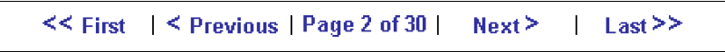
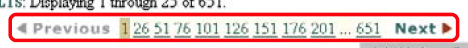
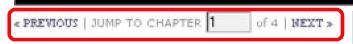
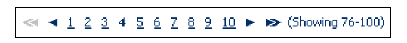
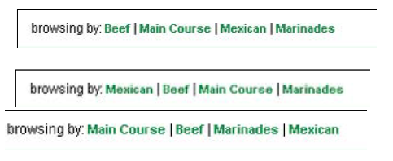
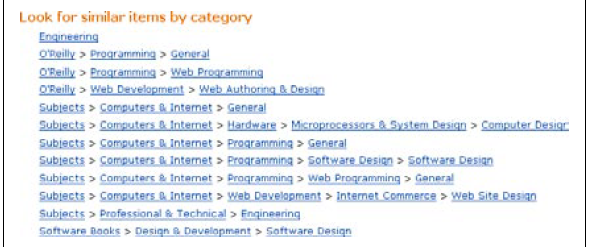

# Diseño de la navegación

## Introducion (Mégane)

Un sitio consta de una estructura que puede variar según la necesidad y, por lo tanto, afectar la navegación. Por ejemplo, si es necesario agregar categorías a una barra de navegación horizontal con categorías, la estructura deberá evolucionar para adaptarse a la navegación. Este resumen pretende presentar los diversos mecanismos de navegación posibles.

## Modo de navegacion (Mégane)

### Paso por paso 

La navegación por pasos permite a los usuarios moverse secuencialmente a través de las páginas. A menudo consiste en una etiqueta de texto y una flecha, y está acompañado por un enlace que también le permite volver a la serie.
Normalmente, una flecha a la izquierda indica un movimiento a la página anterior, y una flecha a la derecha indica la página siguiente. Las flechas solas pueden no ser claras o intuitivas para todos los usuarios en todas las situaciones. Una etiqueta de texto asociada con una flecha evita ambigüedades.

La navegación por pasos es útil en procesos donde la decisión tomada en un paso afecta a algo en el siguiente, como en un asistente o proceso de pedido. También es adecuado para secciones de un documento más largo o capítulos de un libro en línea, así como para encuestas y exámenes en línea. La navegación por pasos proporciona un fácil acceso a las páginas, una tras otra.

### Navegacion por paginacion 

La navegación por paginación es similar a la navegación por pasos, pero incluye información y opciones adicionales. A menudo se encuentra en las páginas de resultados de búsqueda que proporcionan detalles sobre las páginas de resultados. Los conjuntos de resultados suelen tener límites en la cantidad de elementos que se pueden mostrar simultáneamente. Una vez que se alcanza este límite, se muestra un segundo bloque de resultados en una nueva página. Esto se repite hasta que todos los resultados estén representados en varias páginas.
La forma más sencilla de navegación por paginación es la navegación por pasos con la adición de varias páginas. Esto suele aparecer entre los enlaces para avanzar o retroceder.

## "Rastro de miga de pan" (Mégane)

### Inicio y final

A veces, los visitantes deben "rebobinar" a la primera página o "adelantar" a la última página de un conjunto. A menudo, una flecha doble o una flecha con tubería (línea vertical) representa este tipo de navegación. Los mecanismos de rebobinado y avance rápido son buenos para conjuntos más grandes de cosas. El rebobinado y el avance rápido solo pueden agregar más desorden y causar errores potenciales.

Por ejemplo: 

### Aceso directo en pagina

Hay varias técnicas para acceder a una página directamente:

- Por lo general, se muestra un recuento lineal de fragmentos de página (por ejemplo, página 1, 2, 3, 4, etc.) junto con los controles de navegación por pasos.
Por ejemplo : 

- También podemos mostrar el número de elementos en cada página. Por ejemplo: 

- Podemos permitir a los usuarios ingresar directamente al segmento al que desean saltar. Esto se puede hacer incrustando un cuadro de texto dentro de las flechas de paginación. Por ejemplo: 

La combinación de elementos de los ejemplos anteriores también es posible. Generalmente, lo mejor es mostrar las flechas oscurceren, porque proporciona información potencialmente valiosa para orientar al visitante. Por ejemplo: 

### Organizacion de ruta

Como mecanismo de navegación, el rastro de ruta de navegación muestra el camino de una persona a través de un sitio. Se compone de elementos, o nodos, que están encadenados. Pueden ser diferentes.

#### Localizacion
El tipo más común de  ruta de navegacion en general:
- Muestra la posición actual dentro de un sitio.
- Proporciona accesos directos a páginas vistas anteriormente y/u otras áreas del sitio.

Son una representación lineal de la estructura de un sitio. Como vemos, muestran una posición fija en el sitio en general.

Ejemplo: Inicio> Ropa para hombres> Camisas> Camisas de vestir.

#### Sendero 
La tecnica de sendero es dinámicos. Cualquier página dada mostrará un rastro de ruta de navegación diferente en función de cómo el usuario llegó a la página. Cada ruta da como resultado exactamente el mismo contenido, pero se tomaron diferentes rutas para llegar allí. A diferencia de los senderos de ubicación, que son bastante estáticos, la implementación de este tipo de senderos es más difícil. Por ejemplo : 

#### Atributor
Los rutas de navegación de atributos describen una página de alguna manera, en lugar de mostrar su ubicación dentro de un sitio o ruta para llegar allí. Muestran su posición dentro de algún esquema de metadatos, a menudo una jerarquía de temas. Permiten el acceso directo a las categorías principales a través de nombres de categorías vinculados. Mostrar el rastro completo proporciona contexto para los elementos en el nivel más bajo, o los nodos finales.

Por lo tanto, por lo general son complementarios de algún otro mecanismo y, a menudo, no son la única forma de navegar. Se cree popularmente que los rastros de ruta de navegación aumentan la comprensión del usuario del contenido y la estructura del sitio al proporcionar un mayor contexto.
Por ejemplo: 

### Navegación ramificada o en árbol (Leire)

La navegación en árbol permite acceder a una estructura jerárquica. Este tipo de mecanismo es bastante común en los sistemas operativos que permiten para navegar por carpetas de archivos, por ejemplo, en Microsoft Windows Explorer. 

Abrir y cerrar el árbol en la Web puede ser problemático en caso de que el usuario recargue la página, ya que ésta se actualiza volviendo al principio. Eso significa que el nodo que estaba expandido queda fuera de su vista, por lo que el usuario tendría que volver a bajar para buscar el punto en el que se había quedado. 

### Mapa del sitio (Leire)

Un mapa del sitio es una representación de la estructura de un sitio web, la cual se utiliza para la navegación. De un vistazo, el mapa nos proporciona una visión general de arriba hacia abajo del contenido del sitio. Usando un mapa del sitio, los visitantes pueden saltar directamente a cualquier página listada en él. 

Un mapa del sitio suele tener su propia página, pero también puede aparecer, en parte,
en otras páginas. Por eso mismo,, los mapas de sitios deben ser simples y fáciles de escanear. Es preferible que las etiquetas utilizadas en el mapa del sitio coincidan con las principales categorías de navegación, así como con los títulos de las páginas.

En caso de que la navegación de la web sea capaz de satisfacer las necesidades del usuario, puede que no sea necesario un mapa. De todas formas, los sitios web con una gran cantidad de contenido y una amplia variedad de tipos de usuarios pueden no ser capaces de predecir las necesidades de cada visitante en todas las situaciones, por lo que. un mapa del sitio podría ayudar.

La utilización de los mapas ha cambiado bastante en a lo largo de los años. En los primeros años del comercio electrónico, muchos sitios incluían uno, pero no era fácil de mantener por lo que ahora se utilizan más en otra clase de sitios web, aquellos que se dedican más a crear contenido escrito o multimedia, ya que los mapas de sitios han sido reconocidos como un buen medio para optimizar la indexación de las webs en los motores de búsqueda. 

### Directorio (Leire)

Los directorios suelen proporcionar acceso a las páginas a través de temas. Yahoo !, fue el primer directorio temático comercial que popularizó este tipo de acceso. A diferencia de los mapas de sitios, los directorios pueden clasificar el contenido por categoría, pero no hay que confundirlo con los índices, los cuales listan los términos alfabéticamente (consulte la siguiente sección). Los directorios son útiles cuando se trata de clasificar  tipos mixtos de información que no tienen una relación jerárquica. También pueden ser muy efectivos para organizar y enlazar a sitios externos.

### Nube de etiquetas (Leire) 

La nube de etiquetas es uno de los mecanismos de navegación más recientes que sirve para enumerar enlaces en orden alfabético, dando prioridad a los que se usan con mayor frecuencia. La frecuencia del tema hace que en la nube se vea con tamaño más grande, lo cual le sirve al usuario para identificar a simple vista los enlaces más importantes o destacados de la página.

Como mecanismo de navegación, las nubes de etiquetas tienen un valor limitado. Si un visitante tiene una necesidad de información más específica, una nube de enlaces puede resultar insuficiente. Las nubes de etiquetas parecen ser más una novedad que una forma realmente efectiva de navegar por la página web. Pese a ello, es cierto que la ponderación visual de los enlaces proporciona información valiosa: ya que de un vistazo se puede ver el tema del que más se ha escrito en la página, así como lo que otros usuarios están hablando.

### A-Z Índices

Un índice A – Z es una guía alfabética de temas, términos y conceptos que se encuentran en un sitio web. Los Índices, en general, complementan el acceso al contenido y pueden servir también como un punto de entrada principal. Proporcionan una vista de abajo hacia arriba del contenido del sitio web, siendo, de alguna forma, la versión electrónica del índice tradicional del libro de consulta. Para aquellos sitios con muchos visitantes frecuentes, como lo puede ser la intranet de una empresa, un índice puede ser particularmente beneficioso. En un índice, cada entrada ordenada alfabéticamente está vinculada a la página en la que se trata ese tema. Los índices pueden ser bastante largos y, a menudo, se dividen en páginas para cada letra del alfabeto. 

### Navegación de barra y pestaña

La forma más simple de una barra de navegación es el de una cadena horizontal de enlaces de hipertexto sin formato. Las barras de navegación a menudo tienen un fondo de color o, también se pueden usar imágenes gráficas para los elementos que la componen. Una ventaja clave de las barras de navegación es que no quitan el ancho horizontal de la barra principal, en la que se colocan las áreas principales de la página. El contenido puede entonces estar extendido por todo el ancho del navegador.

### Menú vertical

Jacob Nielsen afirma que CNET.com fue el primero en hacer un uso extenso y consistente de un mecanismo de navegación (una pila de enlaces a la izquierda de la pantalla) a través de un sitio completo. Los menús verticales son generalmente más flexibles que las barras de navegación o las pestañas, ya que el mecanismo puede extenderse fácilmente hacia abajo. Agregar opciones generalmente no es tan problemático como agregar una pestaña. Los menús verticales generalmente permiten etiquetas más largas, especialmente si pueden ajustarse en dos o más líneas.

### Menu dinamico (Ander)

Los menús dinámicos o "pop-up menus", son aquellos que proporcionan un acceso rápido a las opciones de navegación.

Se consideran dinámicos porque los usuarios deben interactuar con llos antes de poder verlos. Para poder utilizarlos, el usuario deberá colocarse encima del tema seleccionado, tras lo que se desplegarán las opciones de sub-menús.

Estos menús se pueden configurar para que funcionen con el simple posicionamiento del cursor, o haciendo click en alguna de las opciones.

### Menu en cascada

Los menús en cascada son simples codigos HTML. Un recuadro gris con una flecha hacia abajo en su parte derecha que permite desplegar (haciendo click) todas las opciones disponibles para dentro de ese menú en concreto.

### Navegacion visual

En contra de la navegación tradicional de pestañas, barras y menús, existen otras herramientas que pueden ser utilizadas para una navegación diferente:

#### Arboles en estrella

También conocidos como esquemas de arbol radial. Representa las relaciones jerárquicas en una página web. De esta manera, se puede meter muchos datos en un espacio reducido y ordenado.

Cada categoría queda mostrada de manera muy sencilla en el centro del arbol, pudiendo moverte a través de él al gusto.

#### Thesauri virtual

Al contrario que un arbol en estrella, el Thesauri trata de animar al usuario a explorar. Muestra un contenido limitado de conceptos, haciendo que haya que indagar para encontrar lo que estamos buscando.

Esto se utiliza en webs en las que el usuario es invitado a trastear, a sumergirse en el universo de esa web y su información.

#### Cluster visual

En resumen, son circulos dentro de otros círculos. Es una manera muy visual de organizar una página web, ya que se puede ver el número de subtemas dentro de un tema con formas geométricas circulares.

A pesar de que a priori esto puede parecer muy util, se puede caer muy facilmente en el sin sentido, con categorías muy planas.

### Mecanismos del navegador

### Boton atras

Es el botón que todos nosotros conocemos, y que nos permite volver a una página anteriormente visitada. Es decir, al último paso segido antes de llegar a donde quiera que estemos.

### Boton adelante

Es el botón contrario al anterior. Si deseamos volver a avanzar a una página de la que nos acabamos de salir, este es el botón que debemos utilizar.

### Historial de sesion

Son las páginas recientes visitadas durante la sesión de navegación concreta.

### Historial del navegador

Se refiere al record histórico de sitios visitados por el usuario siempre.

### URL

Es la dirección de todos los sitios de internet. Como si fuera nuestra dirección de casa. De esta manera, un navegador puede acceder a los servidores de la página y descargar todo su contenido.
