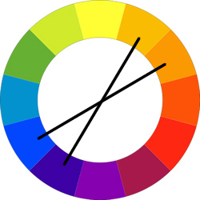

# PLANO DE SUPERFICIE

## 1. Introducción
Para el desarrollo del diseño web se consideran importantes factores como la estructura, el contenido y el diseño visual, pero usualmente se deja de lado la importancia que tienen los colores. Sin embargo, los colores que se usan en la plataforma son de gran importancia, ya que le brinda al usuario comodidad y permite que a largo plazo identifique la organización o plataforma de la misma o en otras palabras se crea un sello organizacional. Debido a ello hablaremos de la teoría del color y de qué manera implementarlos en un sitio web. 

Kuler y paletón son unos de los métodos teóricos que existen para aplicar color a un sitio web, pero en realidad no importa cual de ellos use, lo realmente importante es determinar que colores van a implementar y para ello existen tres posibles opciones: 

1.1. **Esquema de color triádico** que consiste en usar los colores que une a cada extremo del triángulo.

1.2. **Esquema de color compuesto:** se deben usar los colores que señala cada extremo de la X. 

1.3. **Análogos:** son aquellos que se unen por las tres puntas.

Teniendo en cuenta los tres esquemas el diseñador del sitio web, se puede usar cualquier método teórico para desarrollar e implementar los colores adecuados en la plataforma web. Sin embargo, los colores no solo se enfocan para que el sitio web se vea armónico, además deben llevar al usuario a leer lo que queramos que lean y que su energía visual no se gaste viendo colores muy brillantes. Por ende, el contenido de este trabajo se enfoca en algunos tips que los diseñadores o estudiantes de diseño puedan implementar en los sitios web que quieran crear. 

A continuación, se especifican seis normas de seguridad para entender la manera de trabajar con los colores en el diseño web: tonos, matices, saturación, brillo, etc. 

## 2. Los esquemas de color son el lienzo, no pintura
No importa cuanto tiempo te pases creando un diseño web, ya que el contenido es lo más importante, es decir tu diseño de web no debe estar por encima del nivel o calidad del contenido web. Partiendo de ahí, el diseño web debe ayudar a comprender y a atraer el contenido al usuario. 

Por ejemplo, un esquema de colores sutil permite que el punto de atención sea el contenido; sin embargo, un esquema de color fuerte distrae la atención del contenido al usuario.

**Hay que evitar que el diseño web distraiga al usuario y no es recomendable crear un diseño web sin tener previamente un contenido web**. Van unidos: la pintura es el contenido web y el lienzo son los colores. 

## 3. Comienza con una sencilla base 
Si no sabes por donde empezar en la selección de colores del diseño web, lo recomendable es optar por el color blanco o gris claro de fondo, con un texto gris oscuro. Y ¿esto por qué? **La combinación del blanco y el gris garantiza una buena legibilidad** a los usuarios y permite que el contenido basado en texto e imagen ocupen un primer plano. Ver ejemplo.

Recomendaciones:
-	Evitar el uso del negro puro para el texto, el gris oscuro es más cómodo para leer
-	El color de fondo idóneo es el blanco absoluto #FFFFFF 
-	Para otros elementos del fondo utilizar variedades del blanco, #CCCCCC (gris claro)

## 4. Elige un color para los destacados
Antes de empezar a utilizar los colores para el diseño web, hay que tener en cuenta que cuantos más colores se utilicen, más complicado será mantenerlos bajo control.

Por lo tanto, teniendo en cuenta que el fondo del diseño web es blanco y que el texto es gris oscuro, se debe elegir un color para destacar elementos; que podrían ser azul, verde, rosa o **el color que desees**. 

¿Cómo se elige el color destacado?
1.	Crea una caja sobre el color base, es decir en el sitio web.
2.	Mueve la barra deslizante hacia arriba y hacia abajo y escoge el color que funcione bien con el diseño. 
3.	Finalmente elige una “tonalidad” (en inglés *Hue*) de color para los elementos destacado del sitio web. 

Según Mark Fairchild, la tonalidad es el grado en el cual un estímulo puede ser descrito como similar o diferente de los estímulos como rojo, amarillo y azul. La tonalidad se describe mediante una H (*Hue*) y un número, el cuál muestra el grado de tonalidad.  

## 5. Si dudas usa el azul 
Si no sabes qué color usar para destacar ciertos elementos en el diseño de tu página web, usa el azul. El azul es un color muy flexible para trabajar con el mayor número de tipos de sitio. Da igual que tonalidades elijas, puedes variar desde el azul marino hasta el aqua, seguramente aciertes con el tono porque el color azul siempre queda bien.

Aparte del azul, también se puede optar por otros colores como el amarillo o el morado. Estos colores también pueden servir, aunque no quedan bien si se usan tonos demasiado chillones. Estas tonalidades pueden dañar la vista de los usuarios.

## 6. Añadir variaciones al color 
Una vez que se haya elegido el color principal que va a ir en el diseño de la página, el siguiente paso es añadir variaciones. Esto quiere decir que, si hemos elegido el color azul, vamos a variar con tonalidades distintas del color azul. Es conveniente utilizar variaciones de un mismo color con el fin de mantener las cosas simples. 

Podemos utilizar estas variaciones para los siguientes apartados de la página:

- **Efectos de Hover**

- **Bordes de los marcos**

- **Obtener un texto más sutil al del color de resaltado***

- **Gradientes**

- **Efectos de luz y sombra**

## 7. Alejarse de la esquina superior derecha
Es conveniente alejarse de las tonalidades de la esquina superior derecha. En esta parte suele haber colores muy atractivos, pero conviene usarlos bien si no se quiere estropear el diseño de la página web. Por esta razón, mejor no arriesgarse y descartar estas tonalidades.

A continuación, os enseñaremos un ejemplo de la misma página web con una tonalidad neutra y una tonalidad de la esquina superior derecha.

Esta sería una tonalidad neutra. Las zonas que tienen esta tonalidad resaltan en la página, pero no dañan la vista de los lectores, se adapta bien a la vista. Sin embargo, si lo probamos con una tonalidad de la esquina superior derecha ocurre lo siguiente: 

Puede que a la gente le resulte atractivo usar este tono, pero la verdad es que es bastante molesto para la vista. Por esta razón, no conviene usar tonalidades de la esquina superior derecha.

## 8. Referencias
- Kezz Bracey, 6 Beginner "Safety First" Color Guidelines for the Web (en español) 
- Mark Fairchild, "Color Appearance Models: CIECAM02 and Beyond". Tutorial slides for IS&T/SID 12th Color Imaging Conference.
- Thomas Cannon, "Una introducción a la teoría del color para diseñadores web".
