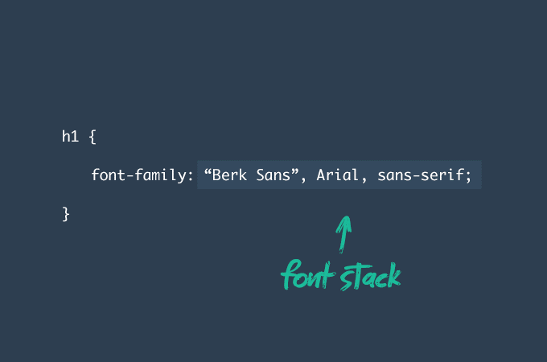
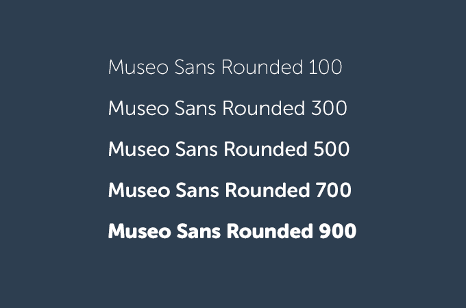
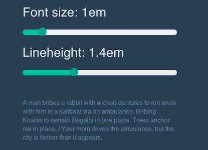
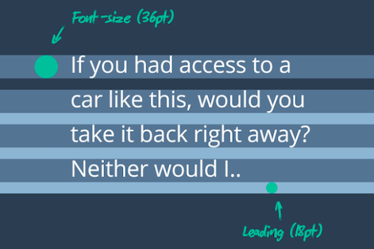
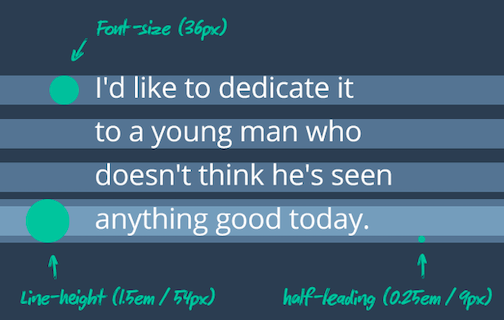
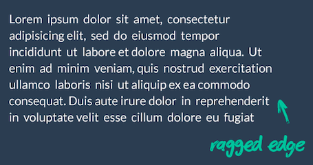
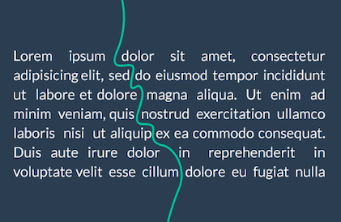
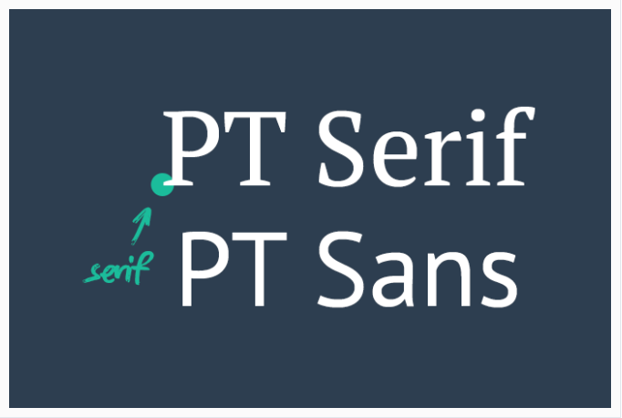
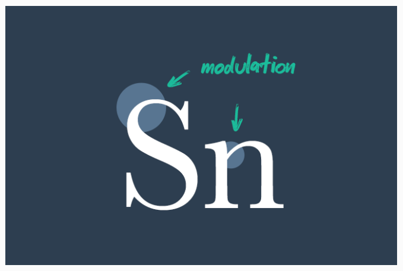

# Tipografía

## 1. Introducción

La tipografía es fundamental para una página web. Podemos encontrar miles de estilos de tipos tipográficos que nos pueden ser útiles para este último apartado de nuestra página web, y que nos servirán para que nuestros usuarios puedan tener una visita agradable y que puedan entender sin ningún problema nuestros contenidos. 

## 2. Tipografía con CSS (Megane)
	a. Noción de la fuente

La noción de fuente es muy importante en este caso, se refiere a “Font-family” en CSS. Podemos manipular la tipografía con esta noción. Para definir esta noción, una fuente es “la colección empacada de caracteres; tradicionalmente bloques físicos usados en imprenta, hoy en día también incluyendo archivos digitales.”

Con el CSS podemos determinar las familias de fuentes que preferimos, en orden de preferencia. A esto le llamamos pila de fuentes o “font stack”.

Podemos también manipular el grosor de la fuente (Font-weight) a través de las hojas de estilo. Es posible de ir de 100 a un máximo de 900, necesito de tener en cuento que 400 es lo que llama regular. En CSS, puede ser controlada con {font-weight: 300;}, {font-weight: bold;}. 

Ejemplo : 

	b. Opciones para mejorar la legibilidad

Primero debemos hacer una diferencia entre la legibilidad lingüística y la legibilidad formal. Usamos el termino legibilidad formal cuando nos referimos a detalles tipográficos; la capacidad de reconocer letras y palabras individuales. La legibilidad lingüística tiene un rol más funcional, está relacionada con la facilidad que tendrá un lector para comprender o asimilar un bloque o fragmento texto.

En este parte podemos hablar de los cajas, Caja alta (Uppercase) y caja baja (lowercase) hacen referencia a las letras en mayúscula y en minúscula espectivamente. El término caja tiene su origen en los cajetines usados en la impresión con letras de plomo, la caja alta es para las letras mayúsculas, la caja baja hace referencia a minuscula. Cuando uses la caja alta (especialmente con tamaños de letra pequeños) es aconsejable aumentar el espacio entre caracteres para mejorar la legibilidad (tracking). En CSS llamamos a esto "letter-spacing" y puede expresarse con valores positivos y negativos, normalmente medido en centésimas de un em mientras que el tracking afecta a la densidad del carácter en su conjunto dentro de un línea o bloque de texto dado.

Con frecuencia se confunde tracking con kerning. El Kerning hace referencia al ajuste del espacio entre dos pares de letras concretas (no a todo un grupo de caracteres) y se utiliza para mejorar la legibilidad. Pero es dificil de usar el kerning en CSS. Sin embargo, podemos usar de las ligaduras que llevan el kerning al siguiente nivel, ofreciendo el reemplazo con glifos para ciertos pares de caracteres. Ejemplo: & para y.

Ademas, podemos usar tambien de la funcion CSS word-spacing que puede ser util. Modificar el espacio entre las palabras, acrecentándolo o disminuyéndolo, puede tener un impacto significativo en la legibilidad del texto. El espacio de palabras ideal varía de una circunstancia a otra, dependiendo de factores tales como letterfit, tipo de color y tamaño. 

## 3. Decisiones de maquetación 

A la hora de maquetar es importante tener en cuenta las proporciones de la tipografia ya que influyen en el espacio vertical de entre líneas. Por ello es aconsejable crear un ajuste de intelineado para cada fuente que usemos. 

Es importante tener en cuenta dos aspectos: 
- Si el espacio en vertical es mínimo provocará que el texto tenga un aspecto abarrotado esto dificultará saber cuando comienza la siguiente línea. 
- Si el espacio es excesivo la lectura será incómoda y poco legible.

En el diseño web es aconsejable usar unidades de medida relativas, especialmente en lo concrniente a la tipografía. El interlineado se debe de escoger en función al tamaño de la fuente. Si usamos valores em para definir el interlineado, siempre estará relacionado con el tamaño de la fuente. En el siguiente ejemplo, vemos como afecta a la legibilidad el cambio de los valores de la altura de línea o interlineado. 

Tradicionalmente llamos interlineado al espacio que hay entre líneas (no confundirlo con la altura de línea "line-height" en CSS)

Para calcular la altura de línea, se añade un valor igual a la mitad del interlineado, tanto por encima como por debajo de los caracteres. EJEMPLO: Un tamaño de fuente de 36px, con una altura de línea de 54px (1,5em) deberemos de añadir un espacio de 9px tanto por encima como por debajo de los caracteres (54-36=18 18/2=9)

Ahora hablaremos de la jsutificación; es decir, la alineación horizontal del texto. En la siguiente imagen el texto está alineado a la izquierda ("bandera izquierda"),también podría esta alineado a la derecha ("bandera derecha"), estar centrado o justificado a ambos lados. Cuando realizamos justificación mediante CSS debemos de aplicar la propiedad text-align, por ejemplo: {text-align: center;}

El texto al estar totalmente justificado elimina el margen variable...

... puede causar un efecto no desea denominado "rios", huecos que forman canales verticales en el bloque de texto.

En el mundo de la maquetación fluida (fluid layouts), donde la anchura del cuerpo del texto puede ser dificil de concretar, los textos justificados debemos de usarlos con mucha cautela. 

## 4. Seleccionar una tipografía

Como hemos comentado anteriormente, el "tipo de tipografía que utilizaremos en nuestra página web es esencial. Bien para la comodidad del usuario, o la legibilidad que tienen a la hora de leer el contenido que haya en ella. 

En primer lugar, ¿se trata de una tipografía con serifas (serif) o sin serifas (sans-serif)? Las serifas son esos trazos adicionales que rematan los trazos principales de una tipografía. Fuentes como la Arial no tienen estos remates, son por tanto fuentes de “palo” o sans-serif.

Se dice que las serifas ayudan a distinguir mejor las letras y seguir el flujo del texto, haciendo que las palabras se perciban más cohesionadas, lo cual facilita la lectura. Sin embargo, en ocasiones, la forma de los caracteres puede ser tan complicada que acaba fatigando al lector y en consecuencia entorpecer la comprensión del texto. Este tema ha sido muy discutido durante décadas y no se ha presentado nunca ninguna evidencia concreta que demuestre cuál de los dos tipos de letra es más legible.

Al ser tan importante la tipografía utilizada, podría decirse que seleccionar una tipografía puede llegar a ser hasta complicado. Debemos elegir diferentes tipos y diseños de tipografía dependiendo del tipo de contenido que vayamos a escribir. Ya sea que estés buscando una para los titulares, para el cuerpo del texto, para los bloques de citas, etc., hay muchos factores en juego.

Cabe destacar que en ocasiones, la forma de los caracteres puede ser tan complicada que acaba causando ‘estragos’ al lector y en consecuencia entorpecer la comprensión del texto. 

Uno de los conceptos más importantes en el terreno de la tipografía, es la legibilidad formal. Usamos el termino legibilidad formal cuando nos referimos a detalles tipográficos; la capacidad de reconocer letras y palabras individuales. La legibilidad lingüística tiene un rol más funcional, está relacionada con la facilidad que tendrá un lector para comprender o asimilar un bloque o fragmento texto.

Los trazos dentro de la forma de un carácter, particularmente en las tipografías serif, puede variar también en estilo y en grosor; siendo "hairline" el trazo más fino de todos los existentes.

Por tanto, algunos trazos, especialmente los curvilíneos, tendrán un grosor que variable a lo largo de extensión. Llamamos a esto modulación. Esta modulación equilibra el peso en conjunto de un carácter y evita que se produzcan áreas excesivamente pesadas en las uniones de los distintos trazos.

Una mala modulación del trazo dará como resultado un carácter tosco y pesado en comparación con el resto del conjunto. David Kadavy llama a esto 'equilibrio de mancha', y normalmente se toma como criterio para definir la calidad de una tipografía bien diseñada. Echa un vistazo a un bloque de texto, después cierra un poco los ojos para captar la impresión de la mancha general que produce.